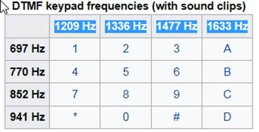

# DTMF_Detection

Detecçao de DTMF de um sinal pelo ADC do MCU STM32F030xx, e calculos de FFT.

NOTA: o sinal para a leitura do ADC possivelmente precisa ser amplificado para a conformacao do mesmo.

Tabela DTMF:

 
Maior Frequencia: 1633Hz
Deltas:
770-697=73
852-770=82
941-852=89
1209-941=268
1336-1209=127
1633-1477=156
1477-1336=141

Menor Delta detecção: D = 770-697=73

Então:

Sampling Frequency > 2*1633Hz = 3266. 

Resolucao << D = 73

Quantidade de samples Qs >> Fs/D = 44. 

Adotemos Qs = 256 (deve ser 64, 128, 256, 512, 1024)

NOTA: Qs dependerá do tamanho de RAM, que neste componente é de 4K apenas.

Entao, Fs = Res*Qs << 73*256 = 18688Hz

Se adortarmos Fs = 3840Hz, entao: 
Resolucao = Fs/Qs = 15Hz
Nosso espectro de Frequencias mostrará valores a cada 15Hz, de 0 Fs/2, ou 0 a 1920Hz
E a taxa de conversao FFT:
TFFT = Qs/Fs = 66.6ms

Para a deteccao do DTMF, foi implementada um Scan do Buffer de saidas, e o resultado é expresso pelo vetor FFT_Result[4], com os 4 maiores valores de Amplitude e respectiva frequencia.
Com este vetor, pode-se avaliar quais as frequencias presentes no espectro.
-Captura de ADC: Executada durante a interrupcao de DMA (apos a captura do ADC), e nao é relevante no calculo de tempo. O tempo de 66.6ms (janela de captura) é a duracao do periodo de captura, porém o MCU nao fica preso durante esta etapa.
-Computacao do FFT e Scan de frequencias: 7.6ms, durante o qual o MCU fica preso nos cálculos.
-Exemplo roda diretamente no Nucleo-F030R8. Necessidade de RAM aproximada de 3.6Kbytes (vetores de DTMF usam muito recurso de RAM).
-Projeto no Cube, DTMF.ioc
 
